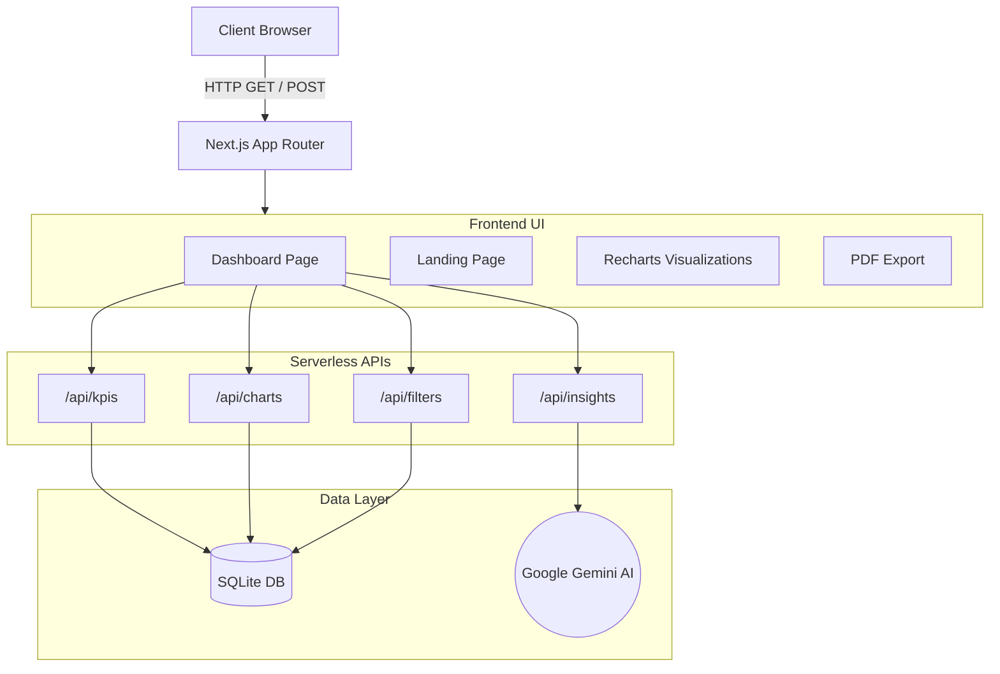

# 🚀 Business Analytics Dashboard

A high-performance, visually stunning web-based analytics dashboard built to visualize a large dataset (300,000+ records) of restaurant orders. It features dynamic AI-generated insights, interactive charting, and real-time data filtering.

---

## 🏗️ Architectural Flow

The application follows a modern serverless architecture utilizing Next.js App Router, bridging a performant SQLite database with a highly interactive React frontend.



---

## ✨ Key Features

- **📊 Real-time KPIs**: Track Total Revenue, Total Orders, Average Order Value, and Total Items Sold with dynamic animations.
- **📈 Interactive Visualizations**:
  - Revenue Over Time (Smooth Area Chart)
  - Sales by Category (Bar Chart)
  - Order Type Distribution (Donut Chart)
- **🤖 AI-Powered Insights**: Integrates with the Google Gemini API to automatically generate strategic business summaries based on your current data view.
- **📄 PDF Export**: Generate and download high-quality PDF reports of your dashboard with a single click.
- **🎯 Dynamic Filtering**: Slice and dice data dynamically by selecting specific Outlets and predefined Timeframes (Last 7 Days, This Month, Last 2 Months, or Custom).
- **✨ Cinematic UI**: Features a beautiful glassmorphic aesthetic with a fluid, animated "Beams" background powered by Framer Motion.

---

## 🛠️ Tech Stack

- **Framework**: Next.js 16 (App Router)
- **Frontend library**: React
- **Styling**: Vanilla CSS Modules & Tailwind CSS (for UI components)
- **Animations**: Framer Motion (`motion/react`)
- **Icons**: Lucide React
- **Charts**: Recharts
- **PDF Generation**: `html2canvas` & `jsPDF`
- **Database**: SQLite (local `.sqlite` file optimized with indexes)
- **AI Integration**: Google Gemini API (`@google/generative-ai`)

---

## 🚀 Setup & Run Instructions

### Prerequisites
- Node.js 18+
- A Google Gemini API Key (Get one from [Google AI Studio](https://aistudio.google.com/))

### 1. Install Dependencies
Clone the repository and install the required npm packages:
```bash
git clone https://github.com/prudhvi916476/Analytics-Dashboard.git
cd Analytics-Dashboard
npm install
```

### 2. Configure Environment Variables
Create a `.env.local` file in the root of the project and add your Gemini API key:
```env
GEMINI_API_KEY="your_api_key_here"
```

### 3. Run the Development Server
```bash
npm run dev
```
Open [http://localhost:3000](http://localhost:3000) in your browser to interact with the dashboard.

*(Note: The repository comes pre-bundled with a `database.sqlite` file which contains the optimized dataset.)*

---

## ☁️ Deployment (Vercel)

The application is fully configured for serverless deployment on Vercel. Even though it uses SQLite, the `next.config.mjs` has been explicitly configured to bundle the `.sqlite` file into the serverless functions, making it a perfectly viable read-only production database.

1. Push your code to GitHub.
2. Go to [Vercel](https://vercel.com/new) and import your repository.
3. Expand the **Environment Variables** section and add your `GEMINI_API_KEY`.
4. Click **Deploy**!

---

## 🧠 Architecture Decisions & Trade-offs

1. **Why SQLite over parsing Excel in memory?**
   Loading a massive 300,000-row Excel file into Node.js memory on every request would lead to severe memory bloat and slow response times. By running a one-time ETL script (Python) to transform the data into a SQLite database, we offload the heavy lifting to an engine designed for fast indexing, filtering, and aggregation.
   
2. **Hybrid Styling Approach**
   The core layout uses Vanilla CSS modules to demonstrate advanced CSS architectural skills, while Tailwind CSS is utilized for specific component-level utilities (like the Beams Background) to rapidly iterate on modern aesthetics.

3. **Client-side PDF Generation**
   PDF generation is handled entirely on the client-side using `html2canvas` and `jsPDF`. This saves server resources and ensures the exported PDF looks exactly like the user's current viewport.
